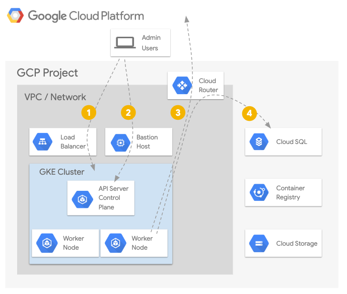

# How to use a Private Cluster in Kubernetes Engine

## Table of Contents

<!-- TOC -->
* [Introduction](#introduction)
  * [Public Clusters](#public-clusters)
  * [Private Clusters](#private-clusters)
  * [Workload Identity Overview](#workload-identity-overview)
* [Demo Architecture](#demo-architecture)
  * [Bastion Host](#bastion-host)
  * [Workload Identity](#workload-identity)
* [Prerequisites](#prerequisites)
  * [Cloud Project](#cloud-project)
  * [Required GCP APIs](#required-gcp-apis)
  * [Run Demo in a Google Cloud Shell](#run-demo-in-a-google-cloud-shell)
    * [Install Terraform](#install-terraform)
    * [Install Cloud SDK](#install-cloud-sdk)
    * [Install kubectl CLI](#install-kubectl-cli)
  * [Authenticate gcloud](#authenticate-gcloud)
  * [Configure gcloud settings](#configure-gcloud-settings)
* [Create Resources](#create-resources)
* [Validation](#validation)
* [Tear Down](#tear-down)
* [Troubleshooting](#troubleshooting)
* [Relevant Material](#relevant-material)
<!-- TOC -->

## Introduction

This guide demonstrates creating a Kubernetes private cluster in [Google Kubernetes Engine](https://cloud.google.com/kubernetes-engine/docs/concepts/kubernetes-engine-overview) (GKE) running a sample Kubernetes workload that connects to a [Cloud SQL](https://cloud.google.com/sql/docs/postgres/) instance using the [cloud-sql-proxy](https://cloud.google.com/sql/docs/mysql/connect-kubernetes-engine) "sidecar". In addition, the [Workload Identity](https://cloud.google.com/kubernetes-engine/docs/how-to/workload-identity) (currently in Beta) feature is used to provide credentials directly to the `cloud-sql-proxy` container to facilitate secure tunneling to the `cloud sql` instance without having to handle GCP credentials manually.

### Public Clusters

By default, GKE clusters are created with a public IP address in front of the Kubernetes API (aka "masters" or "the control plane").  In addition, the GCE instances that serve as the worker nodes are given both private and ephemeral public IP addresses.  This facilitates ease of administration for using tools like `kubectl` to access the Kubernetes API and `SSH` to access the GCE instances for troubleshooting purposes.  Assuming the GKE cluster was created on a subnet in the `default` VPC network of a project, the default access control allows "any" or `0.0.0.0/0` to reach the Kubernetes API and the default firewall rules allow "any" or `0.0.0.0/0` to reach the worker nodes via `SSH`.  These clusters are commonly referred to as "public clusters".

While the authentication and authorization mechanisms for accessing the Kubernetes API over `TLS` and worker nodes via `SSH` offers strong protection against unauthorized access, it is strongly recommended that additional steps are taken to limit the scope of potential access:

1. Restrict to a known list of source subnets for access to the Kubernetes cluster API via `TLS` (tcp/443) using the [master_authorized_networks](https://cloud.google.com/kubernetes-engine/docs/how-to/authorized-networks) access list configuration setting.
1. Restrict to a known list of source subnets or remove the default firewall rules allowing `SSH` (tcp/22) to the worker nodes.

This provides several key benefits from a [defense-in-depth](https://en.wikipedia.org/wiki/Defense_in_depth_(computing)) perspective:

1. Reducing the scope of source IPs that can potentially perform a Denial of Service or exploit against the Kubernetes API server or the `SSH` daemon running on the worker nodes.
1. Reducing the scope of source IPs that can leverage credentials stolen from a developer laptop compromise, credentials found in source code repositories, or credentials/tokens obtained from resources inside the cluster.
1. Decreasing the likelihood of a newly discovered vulnerability being exploitable and/or granting more time to the team to devise a patching/upgrade strategy.

However, fom an operational perspective, managing these access control lists may not be feasible in every organization.  Larger organizations may already have remote access solutions in place either on-premise or in the cloud that they prefer to leverage.  They may also have [dedicated interconnects](https://cloud.google.com/interconnect/docs/concepts/overview) which provide direct, high-bandwidth access from their office network to their GCP environments.  In these cases, there is no need for the GKE clusters to be publicly accessible.

### Private Clusters

GKE offers two configuration items that combine to form what is commonly known as "[private clusters](https://cloud.google.com/kubernetes-engine/docs/how-to/creating-a-cluster)":

1. The GCE instances that serve as the Kubernetes worker nodes do not get assigned a public IP.  Instead, they are only assigned a private IP from the VPC node subnet.  This is the `enable_private_nodes` configuration setting.
1. The Kubernetes API/GKE API/GKE Control Plane IP is assigned a private IP address from a dedicated subnet for this purpose and is automatically accessible from the node and pod subnets.  This is the `enable_private_endpoint` configuration setting.

When both of these are configured on a GKE cluster, a few key behaviors change:

1. The worker nodes no longer have egress to the Internet, and that will prevent the `nodes` and `pods` from having external access.  In addition, `pods` defined using containers from public container image registries like [DockerHub](https://hub.docker.com/search) will not be able to access and pull those containers.  To restore this access, this demo implements a [Cloud NAT](https://cloud.google.com/nat/docs/overview) router to provide egress [Network Address Translation](https://en.wikipedia.org/wiki/Network_address_translation) functionality.
1. Access to other Google Cloud Platform (GCP) APIs like Google Cloud Storage (GCS) and Google Cloud SQL requires enabling [private API access](https://cloud.google.com/vpc/docs/private-access-options) on the VPC Subnet to enable the private routing configuration which directs traffic headed to GCP APIs entirely over the internal GCP network.  This demo connects to the Cloud SQL instance via [private access](https://cloud.google.com/sql/docs/postgres/private-ip).
1. Access to the Kubernetes API/GKE Cluster Control Plane will only be possible from within the VPC subnets.  This demo deploys what is known as a [bastion host](https://cloud.google.com/solutions/connecting-securely) as a dedicated GCE instance in the VPC subnet to allow for an administrator/developer to use [SSH Tunneling](https://www.ssh.com/ssh/tunneling/example) to support `kubectl` access.

### Workload Identity Overview

The [current guide](https://cloud.google.com/sql/docs/mysql/connect-kubernetes-engine) for how to configure the `cloud-sql-proxy` with the necessary GCP credentials involves creating a [service account key](https://cloud.google.com/iam/docs/creating-managing-service-account-keys) in JSON format, storing that in a Kubernetes-native `secret` inside the `namespace` where the `pod` is to run, and configuring the `pod` to mount that secret on a particular file path inside the pod.  However, there are a few downsides to this approach:

1. The credentials inside this JSON file are essentially, static keys and they don't expire unless manually revoked via the GCP APIs.
1. The act of exporting the credential file to JSON means it touches the disk of the administrator and/or CI/CD system.
1. Replacing the credential means re-exporting a new Service Account key to JSON, replacing the contents of the Kubernetes `secret` with the updated contents, and restarting the `pod` for the `cloud-sql-proxy` to make use of the new contents.

[Workload Identity](https://cloud.google.com/kubernetes-engine/docs/how-to/workload-identity) helps remove several manual steps and ensures that the `cloud-sql-proxy` is always using a short-lived credential that auto-rotates on it's own.  Workload Identity, when configured inside a GKE cluster, allows for a Kubernetes Service Account (KSA) to be mapped to a GCP Service Account (GSA) via a process called "Federation".  It then installs a proxy on each GKE worker `node` that intercepts all requests to the [GCE Metadata API](https://cloud.google.com/compute/docs/storing-retrieving-metadata) where the dynamic credentials are accessible and returns the current credentials for that GCP Service Account to the process in the `pod` instead of the credentials normally associated with the underlying GCE Instance.  As long as the proper IAM configuration is made to map the KSA to the GSA, the `pod` can be given a dedicated service account with just the permissions needed.

## Demo Architecture

Given a GCP project, the code in this demo will create the following resources via [Terraform](https://terraform.io):

* A new VPC and new VPC subnets
* A Cloud NAT router for egress access from the VPC subnets
* A Cloud SQL Instance with a Private IP
* A GCE Instance serving as a Bastion Host to support SSH Tunneling
* A GKE Cluster running Workload Identity with no public IPs on either the API or the worker nodes
* A sample Kubernetes deployment that uses the `cloud-sql-proxy` to access the Cloud SQL instance privately and uses Workload Identity to dynamically and securely fetch the GCP credentials.



1. Exposing workloads inside the GKE cluster is done via a standard load balancer strategy.
1. Accessing the Kubernetes API Server/Control Plane from the Internet is through an `SSH` tunnel on the `Bastion Host`.
1. GKE worker `nodes` and `pods` running on those `nodes` access the Internet via Cloud NAT through the Cloud Router.
1. GKE worker `nodes` and `pods` running on those `nodes` access other GCP APIs such as Cloud SQL via Private API Access.

### Bastion Host

Traditionally, a "jump host" or "bastion host" is a dedicated, hardened, and heavily monitored system that was placed in the [DMZ](https://en.wikipedia.org/wiki/DMZ_(computing)) of a network to allow for secure, remote access.  In the cloud, this commonly is deployed as a shared instance that multiple users SSH into and work from when accessing cloud resources.  Tools like the [Google Cloud SDK](https://cloud.google.com/sdk/) and [Terraform](https://terraform.io) are often installed on these systems.  There are two problems with this approach:

1. If users authenticate to GCP using `gcloud`, their credentials are stored in the `/home` directory on this instance.  The same issue applies to users who obtain a valid `kubeconfig` file for accessing a GKE cluster.
1. If users log in via `SSH` and then use `su` or `sudo` to switch to a shared account to perform privileged operations, the audit logs will no longer be able to directly identify who performed an action.  In the case of `sudo` to `root`, that means all GCP credentials in the `/home` directories are available to be used for impersonation attacks (Alex performs malicious actions with Pat's credentials).

This bastion host attempts to solve for both issues.  It runs two services:

1. An [OpenSSH](https://en.wikipedia.org/wiki/OpenSSH)) daemon to support `SSH` access via `gcloud compute ssh` or via [Identity Awareness Proxy](https://cloud.google.com/iap/).
1. A [TinyProxy](https://github.com/tinyproxy/tinyproxy) daemon listening on `localhost:8888` that provides a simple [HTTP Proxy](https://en.wikipedia.org/wiki/Proxy_server).

Note: The bastion host is configured to allow `SSH` access from `0.0.0.0/0` via a dedicated firewall rule, but this can and should be restricted to the list of subnets for your needs.

This means that both `gcloud` and `kubectl` commands can still be run on the local developer/administrator workstation, but `kubectl` commands can be "proxied" through an `SSH Tunnel` made to the bastion on their way to the Kubernetes API without disrupting the TLS connection and certificate verification process.

From a practical standpoint, using the bastion requires two additional steps for `kubectl` to reach the private cluster's Kubernetes API IP:

1. Run `gcloud compute ssh` and forward a local port (`8888`) to the `localhost:8888` on the bastion host where the `tinyproxy` daemon is listening.
1. Provide an environment variable (`HTTPS_PROXY=localhost:8888`) when using `kubectl` to instruct it to use the forwarded port that reaches the tinyproxy daemon running on the bastion host on its way to the Kubernetes API.


### Workload Identity

The use case of this demo requires that the `pgadmin4` (Postgres SQL Admin UI) container has a `cloud-sql-proxy` "sidecar" that it uses to connect securely to the Cloud SQL instance.  The IAM Role that is needed to make this connection is `roles/cloudsql.client`.  This demo creates a dedicated GCP Service Account, binds the `roles/cloudsql.client` IAM Role to it at the project level, creates a dedicated Kubernetes Service Account (`postgres`) in the `default` `namespace`, and grants `roles/iam.workloadidentityuser` on the KSA-to-GSA IAM binding.

The result is that the processes inside `pods` that use the `default/postgres` Kubernetes Service Account that reach for the GCE metadata API to retrieve GCP credentials will be given the credentials from the dedicated GCP Service Account with just the Cloud SQL access permissions.  There are no static GCP Service Account keys to export, no Kubernetes `secrets` to manage, and the credentials automatically rotate themselves.

## Prerequisites

The steps described in this document require installations of several tools and the proper configuration of authentication to allow them to access your GCP resources.

### Cloud Project

If you do not have a Google Cloud account, please signup for a free trial [here](https://cloud.google.com). You'll need access to a Google Cloud Project with billing enabled. See [Creating and Managing Projects](https://cloud.google.com/resource-manager/docs/creating-managing-projects) for creating a new project. To make cleanup easier it's recommended to create a new project.

### Required GCP APIs

The following APIs will be enabled:

* Compute Engine API
* Kubernetes Engine API
* Cloud SQL Admin API
* Secret Token API
* Stackdriver Logging API
* Stackdriver Monitoring API
* IAM Service Account Credentials API

### Run Demo in a Google Cloud Shell

Click the button below to run the demo in a [Google Cloud Shell](https://cloud.google.com/shell/docs).

[](https://console.cloud.google.com/cloudshell/open?cloudshell_git_repo=https://github.com/GoogleCloudPlatform/gke-private-cluster-demo.git&amp;cloudshell_image=gcr.io/graphite-cloud-shell-images/terraform:latest&amp;cloudshell_tutorial=README.md)

How to check your account's quota is documented here: [quotas](https://cloud.google.com/compute/quotas).

All the tools for the demo are installed. When using Cloud Shell execute the following command in order to setup gcloud cli. When executing this command please setup your region and zone.

```console
gcloud init
```

### Tools

When not using Cloud Shell, the following tools are required:

* Access to an existing Google Cloud project.
* Bash and common command line tools (Make, etc.)
* [Terraform v0.12.3+](https://www.terraform.io/downloads.html)
* [gcloud v255.0.0+](https://cloud.google.com/sdk/downloads)
* [kubectl](https://kubernetes.io/docs/reference/kubectl/overview/) that matches the latest generally-available GKE cluster version.

#### Install Terraform

Terraform is used to automate the manipulation of cloud infrastructure. Its [installation instructions](https://www.terraform.io/intro/getting-started/install.html) are also available online.

#### Install Cloud SDK

The Google Cloud SDK is used to interact with your GCP resources. [Installation instructions](https://cloud.google.com/sdk/downloads) for multiple platforms are available online.

#### Install kubectl CLI

The kubectl CLI is used to interteract with both Kubernetes Engine and Kubernetes in general. [Installation instructions](https://cloud.google.com/kubernetes-engine/docs/quickstart) for multiple platforms are available online.

## Deployment

The steps below will walk you through using Google Kubernetes Engine to create Private Clusters.

### Authenticate gcloud

Prior to running this demo, ensure you have authenticated your gcloud client by running the following command:

```console
gcloud auth login
```

### Configure gcloud settings

Run `gcloud config list` and make sure that `compute/zone`, `compute/region` and `core/project` are populated with values that work for you. You can choose a [region and zone near you](https://cloud.google.com/compute/docs/regions-zones/). You can set their values with the following commands:

```console
# Where the region is us-central1
gcloud config set compute/region us-central1

Updated property [compute/region].
```

```console
# Where the zone inside the region is us-central1-c
gcloud config set compute/zone us-central1-c

Updated property [compute/zone].
```

```console
# Where the project name is my-project-name
gcloud config set project my-project-name

Updated property [core/project].
```

## Create Resources

To create the entire environment via Terraform, run the following command:

```console
make create

Apply complete! Resources: 33 added, 0 changed, 0 destroyed.

Outputs:

...snip...
bastion_kubectl = HTTPS_PROXY=localhost:8888 kubectl get pods --all-namespaces
bastion_ssh = gcloud compute ssh private-cluster-bastion --project bgeesaman-gke-demos --zone us-central1-a -- -L8888:127.0.0.1:8888
cluster_ca_certificate = <sensitive>
cluster_endpoint = 172.16.0.18
cluster_name = private-cluster
gcp_serviceaccount = private-cluster-pg-sa@my-project-name.iam.gserviceaccount.com
get_credentials = gcloud container clusters get-credentials --project my-project-name --region us-central1 --internal-ip private-cluster
postgres_connection = my-project-name:us-central1:private-cluster-pg-410120c4
postgres_instance = private-cluster-pg-410120c4
postgres_pass = <sensitive>
postgres_user = postgres
Fetching cluster endpoint and auth data.
kubeconfig entry generated for private-cluster.
```

Next, review the `pgadmin` `deployment` located in the `/manifests` directory:

```console
cat manifests/pgadmin-deployment.yaml
```

The manifest contains comments that explain the key features of the deployment configuration.  Now, deploy the application via:

```console
make deploy

Detecting SSH Bastion Tunnel/Proxy
Did not detect a running SSH tunnel.  Opening a new one.
Pseudo-terminal will not be allocated because stdin is not a terminal.
SSH Tunnel/Proxy is now running.
Creating the PgAdmin Configmap
configmap/connectionname created
Creating the PgAdmin Console secret
secret/pgadmin-console created
serviceaccount/postgres created
serviceaccount/postgres annotated
Deploying PgAdmin
deployment.apps/pgadmin4-deployment created
Waiting for rollout to complete and pod available.
Waiting for deployment "pgadmin4-deployment" rollout to finish: 0 of 1 updated replicas are available...
deployment "pgadmin4-deployment" successfully rolled out
```

The `make deploy` step ran the contents of `./scripts/deploy.sh` which did a few things:

1. Created an SSH tunnel to the Bastion Host (if it wasn't running already) that should still be running in the background.
1. Used `kubectl` to create a configmap containing the connection string for connecting to the correct Cloud SQL Instance, a dedicated service account named `postgres` in the `default` namespace, and added a custom annotation to that service account.
1. Ran `kubectl` to deploy the `pgadmin4` deployment manifest.
1. Ran `kubectl` to wait for that deployment to be up and healthy.

Now, with the SSH tunnel still running in the background, you can interact with the GKE cluster using `kubectl`.  For example:

```console
HTTPS_PROXY=localhost:8888 kubectl get pods --all-namespaces
```

Because that environment variable must be present for each invocation of `kubectl`, you can `alias` that command to reduce the amount of typing needed each time:

```console
alias k="HTTPS_PROXY=localhost:8888 kubectl"
```

And now, using `kubectl` looks like the following:

```console
k get pods --all-namespaces
k get namespaces
k get svc --all-namespaces
```

Note: `export`-ing the `HTTPS_PROXY` setting in the current terminal may alter the behavior of other common tools that honor that setting (e.g. `curl` and other web related tools).  The shell `alias` helps localize the usage to the current invocation of the command only.

## Validation

If no errors are displayed during deployment, you should see your Kubernetes Engine cluster in the [GCP Console](https://console.cloud.google.com/kubernetes) with the sample application deployed. This may take a few minutes.

Validation is fully automated. The validation script checks for the existence of the Postgress DB, Google Kubernetes Engine cluster, and the deployment of pgAdmin. In order to validate that resources are installed and working correctly, run:

```console
make validate

Detecting SSH Bastion Tunnel/Proxy
Detected a running SSH tunnel.  Skipping.
Checking that pgAdmin is deployed on the cluster... pass
Checking that pgAdmin is able to connect to the database instance... pass
```

The `make validate` performs two simple checks that can be done manually.  Checking the status of the `pgadmin4` deployment for health:

```console
k rollout status --timeout=10s -f manifests/pgadmin-deployment.yaml

deployment "pgadmin4-deployment" successfully rolled out
```

And using `kubectl exec` to run the `pg_isready` command from the `pgadmin4` container which performs a test connection to the Postgres database and verifies end-to-end success:

```console
k exec -it -n default "$(k get pod -l 'app=pgadmin4' -ojsonpath='{.items[].metadata.name}')" -c pgadmin4 -- pg_isready -h localhost -t 10

localhost:5432 - accepting connections
```

You may also wish to view the logs of the key `pods` in this deployment.  To see the logs of the `pgadmin4` container:

```console
k logs -l 'app=pgadmin4' -c pgadmin4 -f
```

To see the logs of the `cloud-sql-proxy` container:

```console
k logs -l 'app=pgadmin4' -c cloudsql-proxy -f 
```

To see the logs of the `gke-metadata-proxy` containers which handle requests for "Workload Identity":

```console
k logs -n kube-system -l 'k8s-app=gke-metadata-server' -f
```

## Tear Down

When you are finished with this example you will want to clean up the resources that were created so that you avoid accruing charges. Teardown is fully automated. The destroy script deletes all resources created using Terraform. Terraform variable configuration and state files are also cleaned if Terraform destroy is successful. To delete all created resources in GCP, run:

```console
make teardown
```

## Troubleshooting

* **The create script fails with a `Permission denied` when running Terraform** - The credentials that Terraform is using do not provide the necessary permissions to create resources in the selected projects. Ensure that the account listed in `gcloud config list` has necessary permissions to create resources. If it does, regenerate the application default credentials using `gcloud auth application-default login`.
* **Terraform timeouts** - Sometimes resources may take longer than usual to create and Terraform will timeout. The solution is to just run `make create` again. Terraform should pick up where it left off.

## Relevant Material

* [Private GKE Clusters](https://cloud.google.com/kubernetes-engine/docs/how-to/creating-a-cluster)
* [Workload Identity](https://cloud.google.com/kubernetes-engine/docs/how-to/workload-identity)
* [Terraform Google Provider](https://www.terraform.io/docs/providers/google/)
* [Securely Connecting to VM Instances](https://cloud.google.com/solutions/connecting-securely)
* [Cloud NAT](https://cloud.google.com/nat/docs/overview)
* [Kubernetes Engine - Hardening your cluster's security](https://cloud.google.com/kubernetes-engine/docs/how-to/hardening-your-cluster)

Note, **This is not an officially supported Google product**
